# Python Project - Super Cashier

## 1. Background

Super Cashier is a program to help customer for doing transaction independently in the shop/supermarket. Customer can add bought items, item quantity and price per item and get discount if the transaction met the total price requirements.

## 2. Tools
Programming Languages and Software:
- Python
- Visual Studio Code

Library:
- Tabulate

## 3. Objective

#### Learning Objective:
- Create simple program cashier using Python
- Utilize OOP, Function, Exception Handling, and PEP8 principles to create Python Program
- Utilize modularization to create module script

#### Program Objective:
- Customer can add item name, item quantity, and price per item
- Customer can update item name/item quantity/price per item
- Customer can delete one item/more items
- Customer can reset their order
- Customer can check their order and total price

## 4. Flowchart

---------------------------------

## 5. Code Explanation

- **_main.py_**: The main script work as program simulation and import module transaction
- **_module_transaction.py_**: The module script that has class Transaction and its function methods

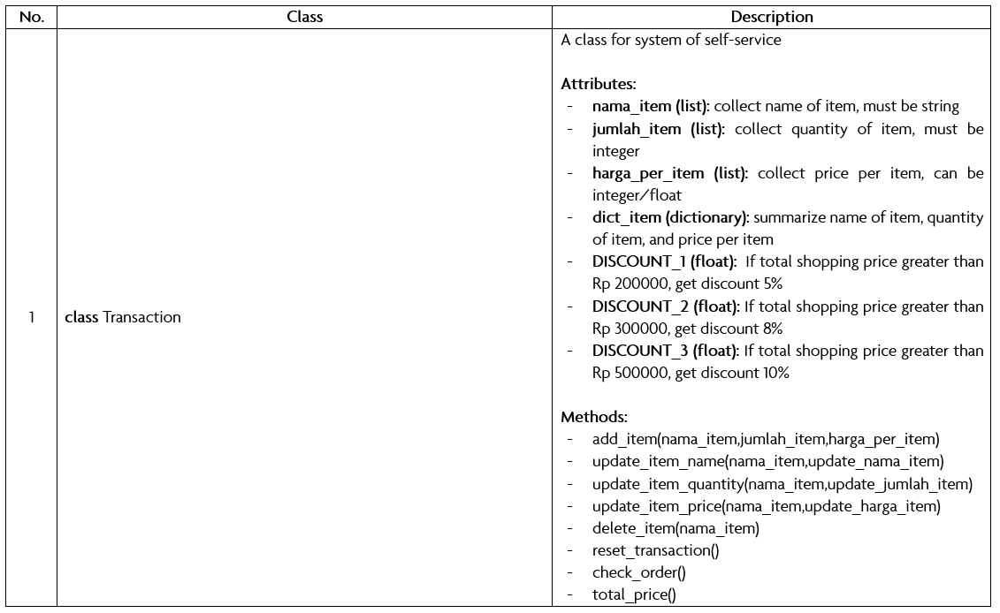

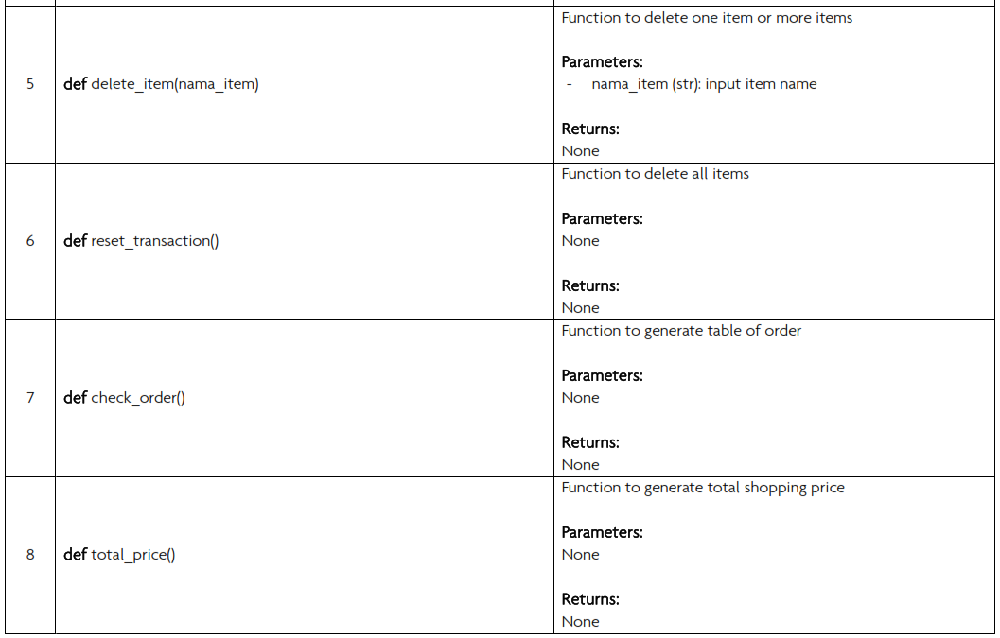

## 6. Test Case

Import module and assign its class in main script:

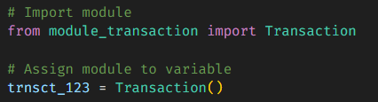

#### 1. Customer add item name, item quantity, and price per item

- Code:

  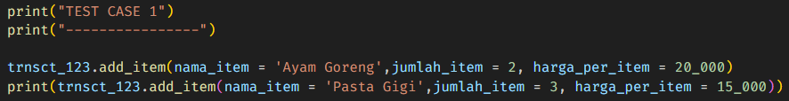

- Result:

  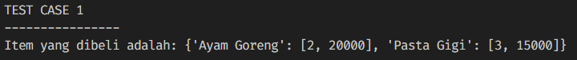

#### 2. Customer delete item

- Code:

  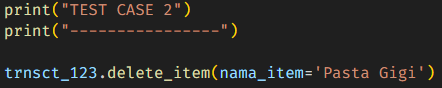

- Result:

  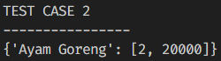

#### 3. Customer reset their order

- Code:

  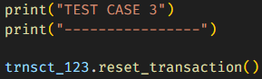

- Result:

  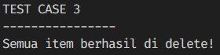

#### 4. Customer check their order and total price

- Code:

  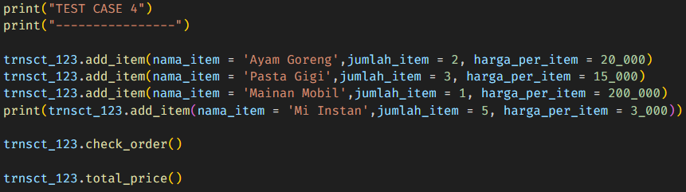

- Result:

  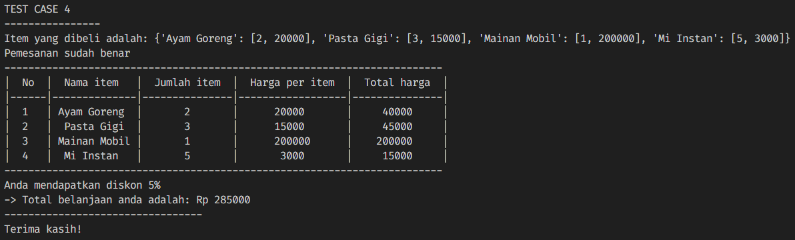

#### 5. Customer update item name/item quantity/price per item

- Code:

  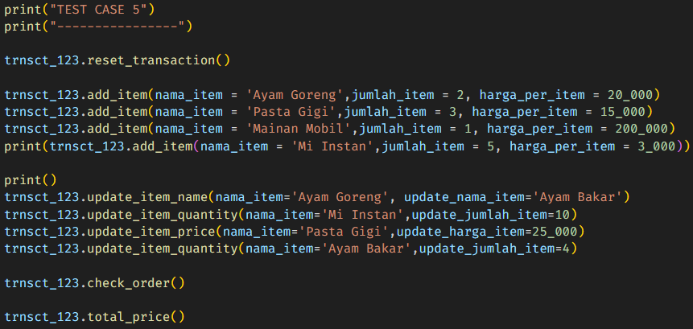

- Result:

  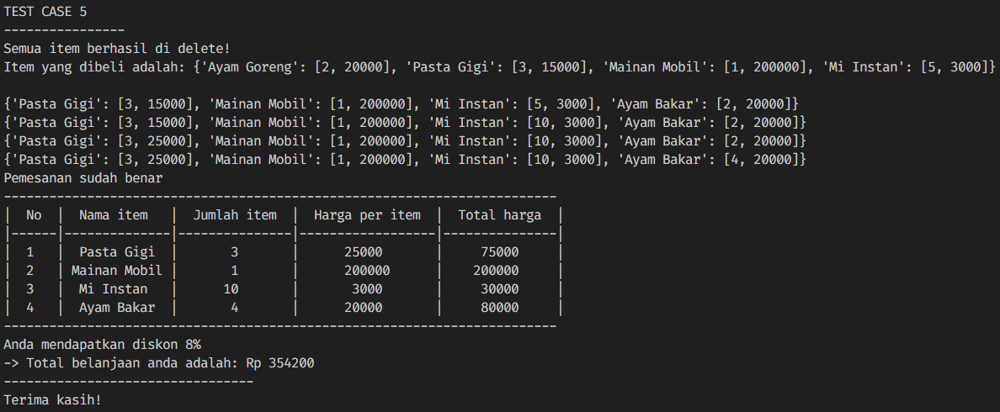

## 7. Special Test Case

Customer input empty item name

- Code:

  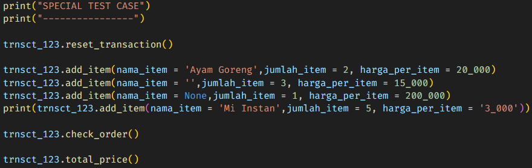

- Result:

  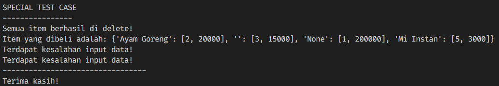

## 8. Future Work

----------------------------------

